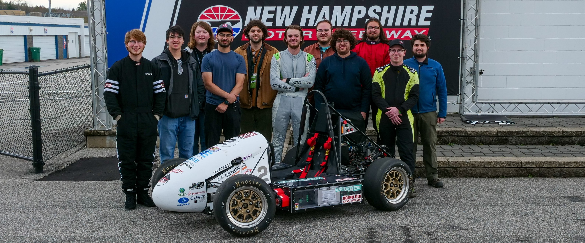
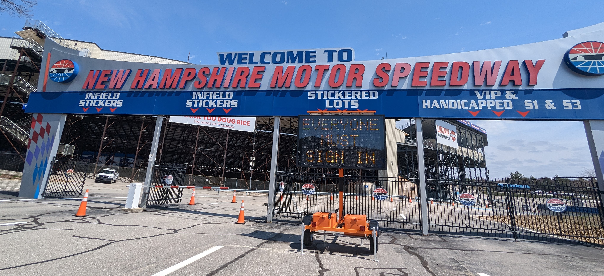
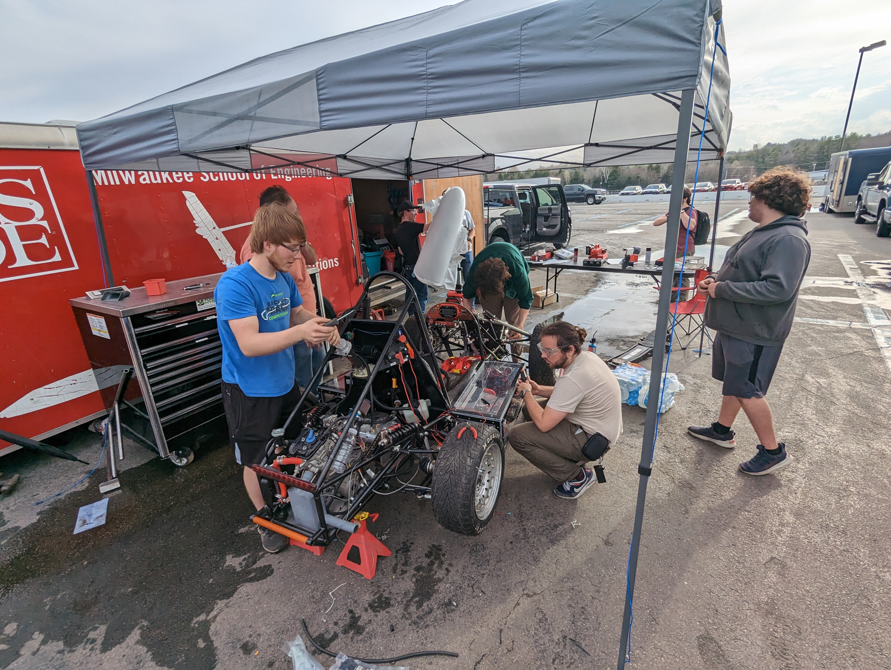
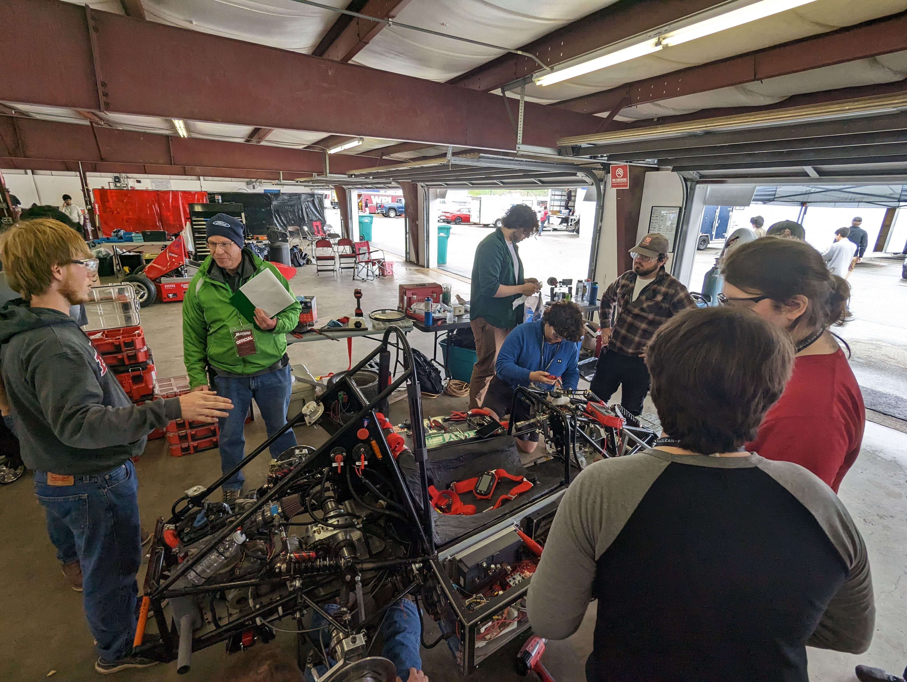
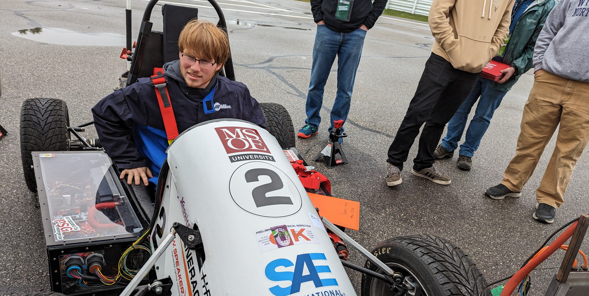
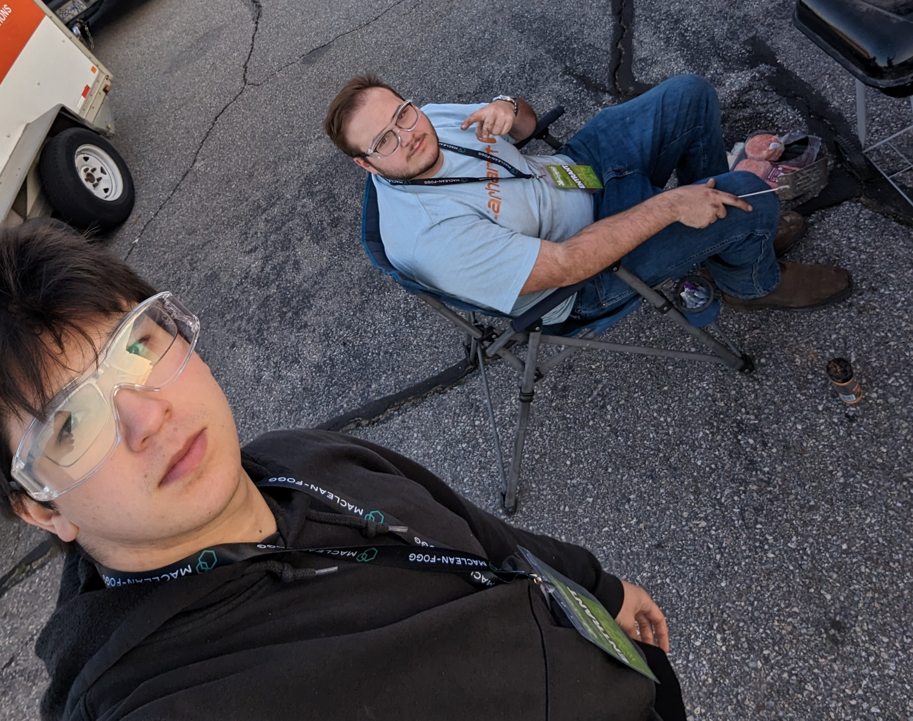
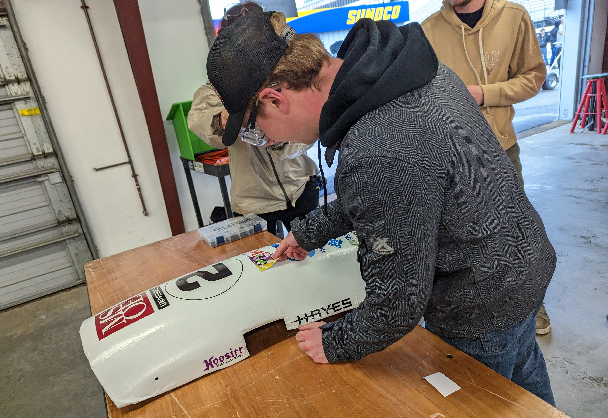
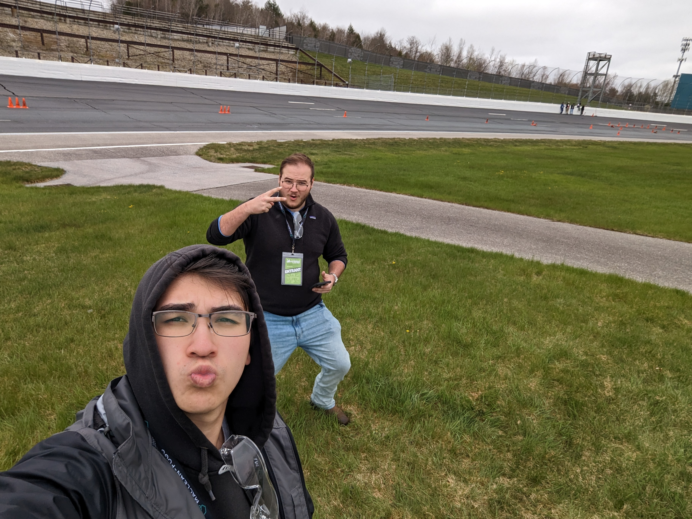
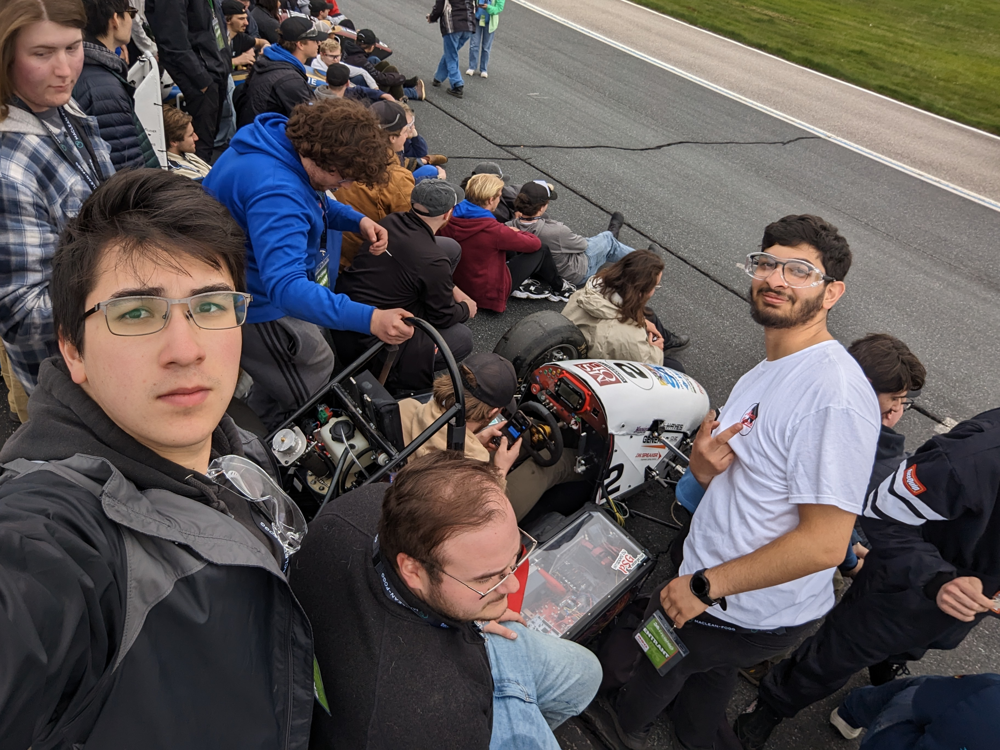

Formula Hybrid is one of the SAE collegiate design competitions. Our team builds a formula style hybrid racecar and competes in a bunch of static and dynamic events. This season was our first year in a two-year design cycle for our car, the MP6. We designed and manufactured the chassis and drivetrain from scratch this year with a new IC engine, redesigned the high-voltage and low-voltage systems, and used the first iteration of a new software stack to control the MP6's powertrain and other subsystems. I had the opportunity this year to work as the design lead for the software team, and we worked on a new codebase prioritizing real-time performance and asynchronous execution using [`embassy-rs`](https://github.com/embassy-rs/embassy). 

In summary, we were the only hybrid team to pass all inspections and move under our own power. We won first place for project management, second in design, and first overall for the hybrid category. I'm super proud of the work we did this year, and what follows is a day-by day of 
the competition from my end. 

## Sunday: Lobster Rolls

I flew into Boston-Logan from O'Hare Sunday morning. We stayed in Boston briefly for some lunch and then drove the hour to New Hampshire Motor Speedway. 

Technically, competition doesn't officially start until Monday, so we set up in the outfield parking lot. The software team's main task was getting the ready-to-drive alarm up and running, which is supposed to sound when the safety system signals OK and the driver flips the ready-to-drive switch. We rigged up the 12V power signal from the safety system to a relay to switch 3.3V logic into the microcontroller, and then have the microcontroller 3.3V send 12V power to the alarm with a BJT. Yeah, not ideal but functional enough. 

## Monday: Pre-check and Design Judging
On Monday, we got to the track at 7:30 to get our entrance passes as early as possible and move our car and equipment into our paddock. We spent most of the day tuning the throttle-by-wire system for the combustion engine air intake. The competition rules require short-to-ground and short-to-high detection for any throttle by wire system, which we accomplished by wiring the two linear potentiometers on the acceleration pedal in reverse polarity. This means that flooring the pedal will send one pot to ground and one to high, and floating the pedal will do the same but reversed. This means that if we a) see two grounds b) see two highs or c) see one reading held to ground or high and the other somewhere in between, we detect a fault and can close the air intake.  Otherwise, the microcontroller reads the throttle input at a fixed rate, and translates that to a PWM signal sent to the servo. 

At about noon, we took the car to electrical pre-check and passed. 

We also had our design report and interviews on Monday afternoon. Each sub-team gave a brief overview of what they had worked on this year, and then the design judges grilled team members on design decisions and what they had worked on specifically. For next year, we learned that the electrical design judges really wanted to see a regenerative braking system in place, so we plan on prioritizing that for next year's competition. 

## Tuesday: Electrical + Mechanical Tech

On Tuesday, we were rained out for most of the morning, so we were not allowed to work on the anything electrical until the weather cleared up. After final touches, like fixing a mysterious electrical arc in the engine compartment and wrapping bare-copper grounding wires to the suspension arms, we went electrical tech inspection and miraculously passed on the first try. If I had had a dollar for every time our inspector said "well, you guys don't have a running tractive control system", I might have been able to afford the large lobster roll instead of the small. 

We decided to run this year as hybrid-in-progress, mainly because we were not quite able to get our Tractive System (high-voltage side) working. We are running a Parker-Hannifin electric motor provided from an all-electric Polaris forklift with a SevCon Gen4 motor controller. We ran into numerous issues trying to configure the motor controller over CAN, including burning out our USB-CAN adapter (likely due to the adapter ground, my laptop chassis, floating with respect to the car's chassis ground). We were never able to fully communicate with the motor controller, so we were unfortunately not able to get the e-motor running this year.  

Later in the evening, we took the last slot in the day for mechanical inspection. After multiple clarifications on which one of Michael Royce's legs we were pulling, we were dismissed from mechanical tech with a surprisingly small number of fixes to be made. We closed out Tuesday night by taking a sawzall to our seat, and I finally learned the bare minimum basics on how the mechanical side of the car works. 

## Wednesday: Tilt, break, and rain test

Wednesday was our most eventful day by far. We kicked off the day by rushing back to mechanical inspection and passing. This was no small feat. On the electrical side, we had a non-zero number of requirements waived for us, because as previously mentioned, we didn't have a running tractive system. However, the chassis, powertrain, controls, safety/ergo, and sidepods teams had more-or-less finished what they set out to do this year, so they were subjected to the full scrutiny of the mechanical tech inspection. I felt like this was a huge achievement for the team: we didn't really expect to pass at all this year, but the months of hard work and dedication meant that we had actually had a shot at driving on track. 

After (probably) fixing a phantom oil leak, replacing our accumulator with a state-of-the-art solid state silicon power cell (50lb sandbag), and fueling up, we were off to the tilt test. The car with driver is raised into the air and tilted at a 45° angle to test for leaks, and then to a 60° angle to test for slippage, simulating the forces experienced in a high-G turn. 

After the tilt test, we were trying to add a dead zone to the throttle range as requested by the drivers. The car was up on jack stands, and someone or another decided it would be a good idea to lower the front of the car and roll it forward while we had a laptop plugged in. The USB port on our microcontroller snapped clean off, and since this was already our spare (we burned a hole through the first one), it was like driving over a nail right after you put on the donut. Luckily, we had a working firmware flashed to the board, but that put an end to any software tuning we were yet to do. 

Next, we had the brake test. The requirement to pass was to accelerate to a reasonable speed, and to have all four wheels lock. This test was the first time that we had seen our car drive under it's own power at competition. However, after eight or nine runs on the test loop, one of our wheels was failing to lock. Additionally, our driver was noticing a lot of flutter in the throttle valve that hadn't been present when the engine was off. We took the car back to the garage, and us electrical guys narrowed the problem down to latent EMI from the ignition interacting with the PWM signal wire controlling the throttle valve. Our solution was just wrapping the PWM signal wire in tin foil, and the flutter vanished. 

Dan and I had volunteered to work on the track for a dynamic event, and we were called over to help out with the autocross event. This was a highlight of the competition for me: we got to watch the top electric-only teams compete for the fastest time in the autocross, the biggest test for both engineering and driver skill. We were able to interact with the drivers and teammates from other schools while they were pitted or when we helped them off track, and were able to glean a few ideas for next time around from them. Funnily enough, multiple other teams had run into EMI issues, and had also resorted to wrapping whichever wire in tin foil. Big thanks to University of Southern Alabama for bringing tin foil, it sounds like that one roll saved saved six or seven teams. 

After the autocross, we resorted to taking off the brake pads and roughing them up to try to squeeze as much stopping power as possible out of them. Once we got to our problem wheel, we found that the brake pad was covered in grease. Go figure. 

Our last test for the day was the rain test, where we had to survive two minutes under a sprinkler with no electrical hard faults. We accomplished this through pure determination, ingenious sidepod design and not having working high-voltage system to fault in the first place. 

<video controls>
    <source src="./vid/raintest.webm" type="video/webm">
    <a href="/shared-assets/videos/flower.webm">WEBM</a>
</video>

## Thursday: we win

Thursday morning, we went to brake test and passed. The brake test inspectors let us do some practice laps around the parking lot, and the microcontroller board rattled out of it's socket and killed itself, meaning we lost throttle. So, with nothing left to do, we packed up the trailer, cleaned out the garage, and waited for the awards ceremony. Although we didn't make it on track, we were the only hybrid car to drive at competition this year. 

## Thoughts 

Overall, I thoroughly enjoyed competition this year and learned a lot. This really did feel like a culmination of a lot of my education so far, and throughout the year and at competition I got to interact with real things that were previously only concepts or isolated in a lab environment. To put it in business-marketing jargon, our cross-functional team successfully developed a cutting-edge hybrid race car from conceptualization to completion, leveraging interdisciplinary expertise to optimize performance and efficiency, resulting in a competitive edge in the automotive industry landscape, or whatever.

As far as the competition itself goes, while taking first place was nice and all, it was a little bittersweet. Out of thirty-some-odd teams that registered this year, only five teams total and four that showed up registered in the hybrid category. From listening to other people at competition, I think that it's fairly well established that Hybrid is the harder engineering challenge. It sounds like both FSAE ICE-only and tractive-only cars are able to use a lot more things off the shelf, while Hybrid requires a custom drivetrain and computer/software stack by design. For instance, our transfer case was designed from scratch, iterated on by our team, and (mostly) manufactured in-house. What that seems to come to in practice is the electric category starts to slide towards a competition of scale and budget rather than raw engineering. Additionally, while we did win in-class this year, I wish that more teams ran hybrid if only to see more hybrid teams run and compete in dynamic events. I would think that larger teams with a higher budget would be *more* capable of doing Hybrid, but the teams that ran Hybrid this year were all on the smaller side. I would hate to see the Hybrid class keep shrinking in the future. Even though it might be harder than a non-hybrid car, I think that once we get the MP6 fully running, it will be more fulfilling and exciting than if we ran ICE only or electric only. 

For next year, I am going switching to a more hardware-oriented role. There's still work to do on the high-voltage side, and I want to redesign the Hybrid Control Board, the baseboard for the microcontroller, into a more modular system that can have modules swapped in and out if one thing breaks. I'd like to build some more transient protection circuitry for the microcontroller, and possibly build a hardware-only throttle plausibility device that offloads the short detection functionality from the microcontroller. 

## Further Reading
- [MSOE News article about us](https://www.msoe.edu/about-msoe/news/details/msoe-sae-formula-hybrid-team-earns-third-world-championship-title-at-new-hampshire-motor-speedway/)
- [NHMS article about comp](https://www.nhms.com/media/news/nhms-host-north-america-top-engineering-students-for-annual-formula-hybrid-electric-competition.html)

