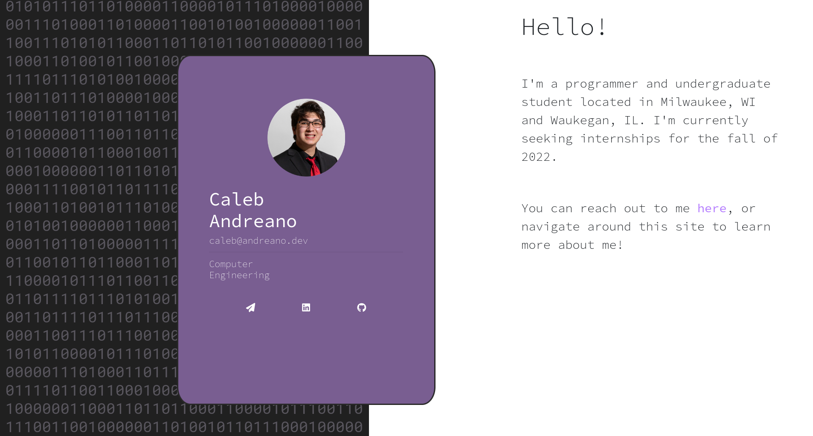
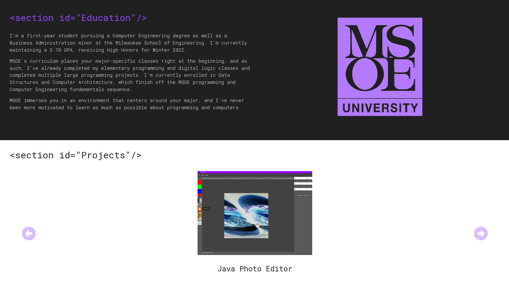
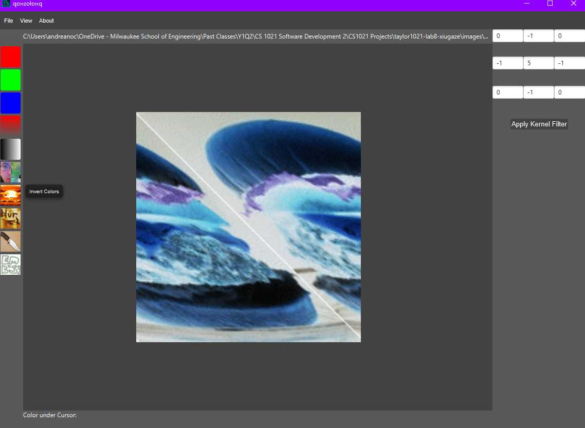

{{ toc }}
# previous attempts
I built my first website around Christmastime of my freshman year in college.
Some upperclassman told me that I needed to have a portfolio website to put my projects on if I ever wanted to have a job (probably the same one that told me I wouldn't ever be a real programmer unless I learned and preached the gospel of vim motions), so I bought a coursera course for like $5 about web development. 

After about the first 10 minutes of video tutorials, I realized that I was probably the greatest aesthetician and web developer to ever live. 


After a few weeks of this one being deployed, I knew I could do better. 
I learned about the bleeding edge of web development, of the best tools in the game like jquery and bootstrap, of carousels and reactive design.



This website was home to such gems as:
- the navy seal copypasta
```html
<h1 class="binary-text">
0101011101101000011000010111010000100000011101000110100001100101001000000110011001110101011000110110101100100000011001000110100101100100001000000111100101101111011101010010000001101010011101010111001101110100001000000110011001110101011000110110101101101001011011100110011100100000011100110110000101111001001000000110000101100010011011110111010101110100001000000110110101100101001011000010000001111001011011110111010100100000011011000110100101110100011101000110110001100101001000000110001001101001011101000110001101101000001111110010000001001001000110010110110001101100001000000110100001100001011101100110010100100000011110010110111101110101001000000110101101101110011011110111011100100000010010010010000001100111011100100110000101100100011101010110000101110100011001010110010000100000011101000110111101110000001000000110111101100110001000000110110101111001001000000110001101101100011000010111001101110011001000000110100101101110001000000111010001101000011001010010000001001110011000010111011001111001001000000101001101100101011000010110110001110011001011000010000001100001011011100110010000100000010010010001100101110110011001010010000001100010011001010110010101101110001000000110100101101110011101100110111101101100011101100110010101100100001000000110100101101110001000000110111001110101011011010110010101110010011011110111010101110011001000000111001101100101011000110111001001100101011101000010000001110010011000010110100101100100011100110010000001101111011011100010000001000001011011000010110101010001011101010110000101100101011001000110000100101100001000000110000101101110011001000010000001001001001000000110100001100001011101100110010100100000011011110111011001100101011100100010000000110011001100000011000000100000011000110110111101101110011001100110100101110010011011010110010101100100001000000110101101101001011011000110110001110011001011100000101000001010010010010010000001100001011011010010000001110100011100100110000101101001011011100110010101100100001000000110100101101110001000000110011101101111011100100110100101101100011011000110000100100000011101110110000101110010011001100110000101110010011001010010000001100001011011100110010000100000010010010001100101101101001000000111010001101000011001010010000001110100011011110111000000100000011100110110111001101001011100000110010101110010001000000110100101101110001000000111010001101000011001010010000001100101011011100111010001101001011100100110010100100000010101010101001100100000011000010111001001101101011001010110010000100000011001100110111101110010011000110110010101110011001011100010000001011001011011110111010100100000011000010111001001100101001000000110111001101111011101000110100001101001011011100110011100100000011101000110111100100000011011010110010100100000011000100111010101110100001000000110101001110101011100110111010000100000011000010110111001101111011101000110100001100101011100100010000001110100011000010111001001100111011001010111010000101110001000000100100100100000011101110110100101101100011011000010000001110111011010010111000001100101001000000111100101101111011101010010000001110100011010000110010100100000011001100111010101100011011010110010000001101111011101010111010000100000011101110110100101110100011010000010000001110000011100100110010101100011011010010111001101101001011011110110111000100000011101000110100001100101001000000110110001101001011010110110010101110011001000000110111101100110001000000111011101101000011010010110001101101000001000000110100001100001011100110010000001101110011001010111011001100101011100100010000001100010011001010110010101101110001000000111001101100101011001010110111000100000011000100110010101100110011011110111001001100101001000000110111101101110001000000111010001101000011010010111001100100000010001010110000101110010011101000110100000101100001000000110110101100001011100100110101100100000011011010111100100100000011001100111010101100011011010110110100101101110011001110010000001110111011011110111001001100100011100110010111000001010 
<h1> 
```

- a legal violation




- `hamburger.msoe`



My intention with this website was to have a way to showcase projects that I couldn't describe effectively or concisely on my resume.
This was still all handmade HTML and CSS.
I had a template HTML document that I'd copy every time I wanted to make a new page. 

Towards the end of freshman year, three things happened. 
First, I installed linux for the first time (arch btw). 
Second, I watched this [luke smith video](https://www.youtube.com/watch?v=QTolhoxMyXg) about [hugo](https://gohugo.io/), where I learned I couldn't be a le based epic linux chad writing html, bro. 
Third, I started doomscrolling on [orange reddit](https://news.ycombinator.com/), the worst website of all time. 
This showed me that every decent developer used some kind of static site generator, and had enough well-crafted opinions that definitely needed to be shared with the world in blog form. 

I can't be caught lookin like an amateur.


I could have been fine with this. 
I liked the idea of Hugo and static site generators. 
I *didn't* like that I had to learn how to wrangle another tool to make webpages come out how I wanted to.
Even for my simple website, Hugo started to feel more like a web framework than a markdown-to-html converter. 
Also, not really knowing what was going on under the hood felt off; it kinda took away the excitement of hacking on the website.  

Ok, so I have a few options here: 
1. ~~use something more simple, like [bearblog](https://github.com/HermanMartinus/bearblog) or [blades](https://www.getblades.org/)~~ build my own site generator. 

# the static site generator

There's nothing particularly interesting about the ssg I built for this site. 
I'm actually surprised at how easy it was to do, to the point where I think that any programmer with a few hours on their hands can throw something basically functional together. 
The ssg works very simply: given a directory, it traverses it and copies all the files in-place into a target directory. 
If it finds a markdown document, it first converts the document to HTML, and then chooses a template to wrap the HTML content in. 
That's pretty much it. 

I rely on [`pulldown-cmark`](https://github.com/pulldown-cmark/pulldown-cmark) to convert the markdown documents it finds. 
`pulldown-cmark` is dead simple to use: you just construct a `Parser` over the source text of a markdown document, pass it some options, and it spits out some HTML: 

```rust
let options = Options::ENABLE_MATH
    | Options::ENABLE_FOOTNOTES
    | Options::ENABLE_SUPERSCRIPT
    | Options::ENABLE_SUBSCRIPT
    | Options::ENABLE_STRIKETHROUGH;
let parser = Parser::new_ext(&markdown_content, options);
let mut html_content = String::new();
pulldown_cmark::html::push_html(&mut html_content, parser);
```

`Parser` is `Iterator`, and gets consumed by `push_html`. 
This means you can preprocess the iterator stream to change the document structure in-place before emitting text. For instance, if I wanted to convert <span class="latex">L<sup>a</sup>T<sub>e</sub>X</span> to MathML at the parse step, I could do something like:

```rust
use pulldown_cmark::{CodeBlockKind, CowStr, Event, Tag, TagEnd};

#[derive(Debug, Default)]

pub struct Preprocessor<'a, I: Iterator<Item = Event<'a>>> {
    parent: I,
}


impl<'a, I: Iterator<Item = Event<'a>>> Preprocessor<'a, I> {
    pub fn new(parent: I) -> Self {
        Self { parent }
    }
}

impl<'a, I: Iterator<Item = Event<'a>>> Iterator for Preprocessor<'a, I> {
    type Item = Event<'a>;

    #[inline]
    fn next(&mut self) -> Option<Self::Item> {
        match self.parent.next()? {
            Event::InlineMath(c) => {
                return Some(Event::Html(
                    latex2mathml::latex_to_mathml(
                        c.as_ref(),
                        latex2mathml::DisplayStyle::Inline,
                    )
                    .unwrap_or_else(|e| e.to_string())
                    .into(),
                ));
            }
            Event::DisplayMath(c) => {
                return Some(Event::Html(
                    latex2mathml::latex_to_mathml(
                        c.as_ref(),
                        latex2mathml::DisplayStyle::Block,
                    )
                    .unwrap_or_else(|e| e.to_string())
                    .into(),
                ));
            }
            other => return Some(other),
        };
    }
}
```
and then wrap my parser like:

```rust
let parser = Parser::new_ext(ex, options);
let preprocessor = preprocessor::Preprocessor::new(parser);

let mut output = String::new();
pulldown_cmark::html::push_html(&mut output, preprocessor);
```
I opted to parse the event stream in two passes, which lets me hold some state about the document and coax out some additional data and features as I go. 
This also lets me look ahead in the stream, consume multiple events, and replace events arbitrarily instead of only being able to process or substitute single events. 

For instance, I use `synctect` for syntax highlighting in code blocks. 
Hacking together something like this lets the parser create statically-highlighted code snippets before or at the parse step. 

```rust
let mut parser = Parser::new_ext(&content, options).peekable();
let mut events = Vec::new();

let mut syntax: Option<&SyntaxReference> = None; 

let mut to_highlight = String::new();
let mut in_code_block = false;

while let Some(event) = parser.next() {
    match event {
        Event::Start(Tag::CodeBlock(kind)) => {
            if let CodeBlockKind::Fenced(lang) = kind {
                syntax = ss.find_syntax_by_token(&lang);
            }
            in_code_block = true;
        },
        Event::End(TagEnd::CodeBlock) => {
            has_code = true;
            if in_code_block {
                let html = match syntax {
                    Some(syn) => highlighted_html_for_string(&to_highlight, &ss, &syn, &theme).unwrap(),
                    None => to_highlight,
                };
                events.push(Event::Html(html.into()));
                to_highlight = String::new();
                in_code_block = false;
            }
        },
        Event::Text(t) => {
            if in_code_block {
                to_highlight.push_str(&t);
            } else {
                events.push(Event::Text(t))
            }
        },
    };
}
```


- how i did before
    - first website
        - talk about handmade things
        - angela yu course that I didn't finish
    - second site
    - third website
        - based luke smith, hugo, minimalism
        - learning things that are specific to hugo, not the web in general, annoying
        - there is a way to do everything I want to do, but always requires some hugo-specific stuff
    - github pages
        - bad

- static site generator
    - make it work, make it right, make it fast (Kent Beck)
    - basic: pulldown cmark
        - show how you can modify the iterator stream to a) extract information about it and b) modify it before consumption. 

- comment engine


- nix thing
